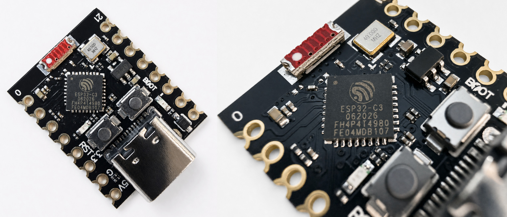
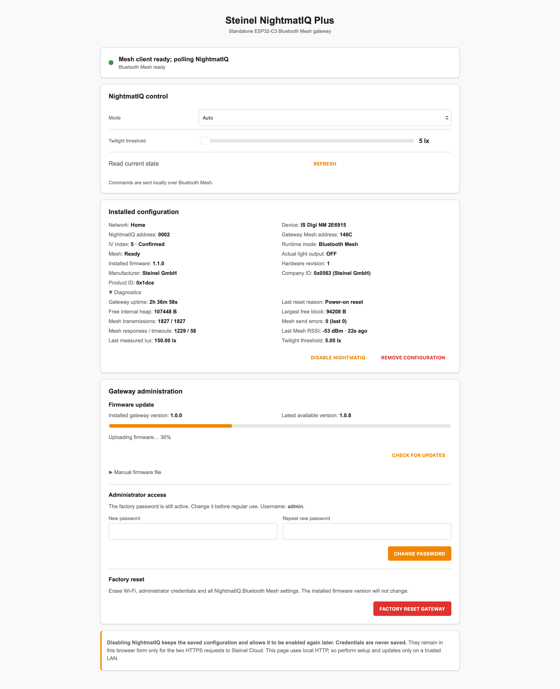
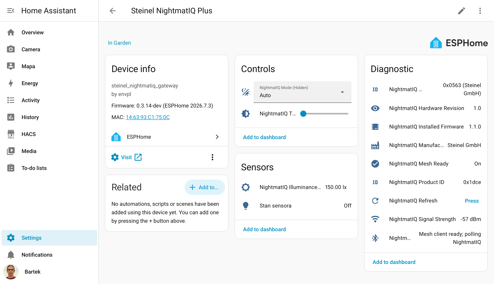
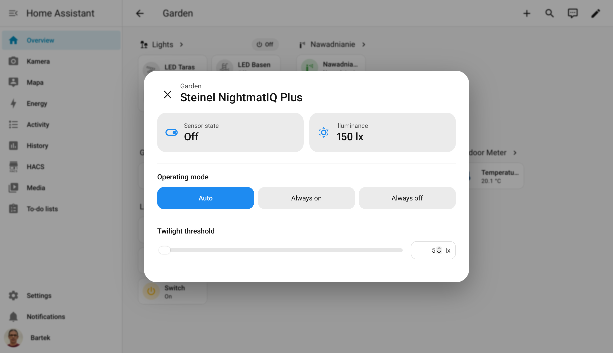

# Steinel NightmatIQ Plus Gateway für ESP32-C3

[English](README.md) · [Polski](README_PL.md)

> **Eigenständiges ESP32-C3 Bluetooth-Mesh-Gateway für lokale Steuerung, Diagnose, Firmware-Aktualisierungen und Home-Assistant-Integration des Steinel NightmatIQ Plus.**

```text
Steinel NightmatIQ Plus <-> Bluetooth Mesh <-> ESP32-C3 Gateway -> Home Assistant
```

Diese Community-Firmware auf Basis von ESPHome macht einen ESP32-C3 Super Mini zu einem dedizierten lokalen Gateway für Steinel NightmatIQ Plus. Sie importiert die vorhandene Steinel-Netzwerkkonfiguration, kommuniziert direkt über Bluetooth Mesh, stellt eine kennwortgeschützte Browseroberfläche bereit und überträgt Steuerungs-, Sensor-, Identitäts- und Diagnoseentitäten an Home Assistant.

Autor und Betreuer: **Bartosz Supcziński** — <bartek@env.pl>

## Funktionsweise

NightmatIQ Plus verwendet Bluetooth Mesh, während Home Assistant über ein IP-Netzwerk kommuniziert. Der ESP32-C3 verbindet beide Umgebungen: Er tritt der vorhandenen Mesh-Installation bei, tauscht Befehle und Statusmeldungen direkt mit dem Sensor aus und veröffentlicht sie über ESPHome. Steinel Cloud wird nur während der Einrichtung zum Import der Netzwerkkonfiguration benötigt; der laufende Betrieb erfolgt lokal.

## Abbildungen

### ESP32-C3 Super Mini



### Lokale Weboberfläche

Die integrierte Seite bietet Einrichtung, Steuerung, Diagnose und Firmware-Aktualisierungen im Browser.



### Gerät in Home Assistant

Die standardmäßige ESPHome-Integration stellt NightmatIQ als ein einzelnes Home-Assistant-Gerät bereit.



### Optionaler Home-Assistant-Steuerdialog

Ein optionales Frontend-Modul fasst Sensorzustand, Beleuchtungsstärke, Betriebsart und Dämmerungsschwelle in einem kompakten Dialog zusammen.



## Funktionen

### Lokale Bluetooth-Mesh-Integration

- Import einer Steinel-Netzwerksicherung mit dem im Browser eingegebenen Konto.
- Wiederherstellung von Netzwerk- und Anwendungsschlüssel, IV Index und NightmatIQ-Knotendaten.
- Direkte Kommunikation mit NightmatIQ über Bluetooth Mesh.
- Lesen von Ausgangszustand, Beleuchtungsstärke, Dämmerungsschwelle, Firmwareversion, Hardwareversion und Produktidentität.
- Steuerung der Betriebsarten `Auto`, `Always On` und `Always Off`.
- Einstellung der Dämmerungsschwelle von `1` bis `1500 lx`.

### Zuverlässige Adress- und Sitzungsverwaltung

- Auswahl einer Gateway-Mesh-Adresse aus dem unbelegten Teil des Provisioner-Bereichs.
- Automatische Wiederherstellung, wenn Mesh-Teilnehmer eine wiederverwendete Quelladresse ablehnen.
- Dauerhafte Bestätigung der ersten funktionierenden Quelladresse, damit spätere Neustarts oder eine vorübergehende Nichterreichbarkeit des Sensors keinen unnötigen Adresswechsel auslösen.
- Erhalt der Mesh-Einstellungen bei normalen Neustarts und OTA-Aktualisierungen.
- Begrenzte Wiederholungsversuche und kontrollierte Neustarts beim Wechsel zwischen Cloud- und Bluetooth-Betrieb.

### Weboberfläche des Geräts

- NightmatIQ-Einrichtung über Steinel Cloud.
- Direkte Steuerung und manuelle Statusabfrage.
- Anzeige der installierten Konfiguration und erweiterter Diagnosedaten.
- Mesh-RSSI sowie Übertragungs-, Antwort- und Timeout-Zähler.
- Kennwortgeschützte Browser-Aktualisierung.
- Gateway-Verwaltung für automatische und manuelle Firmware-Aktualisierungen, Administratorkennwort und vollständiges Zurücksetzen auf Werkseinstellungen.

### Home-Assistant-Integration

Die standardmäßige ESPHome-API veröffentlicht:

- tatsächlichen Sensor-Ausgangszustand;
- gemessene Beleuchtungsstärke;
- Betriebsart;
- Dämmerungsschwelle;
- Bluetooth-Mesh-Bereitschaft und Status;
- Signalstärke;
- installierte Firmware und Hardwareversion;
- Hersteller, Company ID und Product ID;
- eine Aktion zur manuellen Aktualisierung.

Home Assistant zeigt alle Entitäten unter einem Gerät namens **Steinel NightmatIQ Plus** an.

## Hardware und Kompatibilität

Erforderlich sind ein ESP32-C3 Super Mini mit 4 MB Flash, eine 2,4-GHz-WLAN-Verbindung und eine im Steinel-Konto vorhandene NightmatIQ-Plus-Installation. Für Erstinstallation und Wiederherstellung wird die native USB/JTAG-Seriell-Verbindung verwendet.

Unter Linux erscheint die USB-Schnittstelle normalerweise als Espressif USB JTAG/serial (`303a:1001`) und als `/dev/ttyACM*`.

Die Firmware ist für ESP32-C3 und ESP-IDF ausgelegt. Erweiterte Bluetooth-5-Funktionen sind deaktiviert, weil Bluetooth Mesh den BLE-4.2-Advertising-Pfad verwendet. Die Konfiguration berücksichtigt den begrenzten Arbeitsspeicher des ESP32-C3.

## Sicherheit

- Das werkseitige Administratorkonto lautet `admin`, das Kennwort `12345678`. Ändern Sie es unmittelbar nach der WLAN-Einrichtung auf der Geräteseite.
- Das Administratorkennwort schützt die lokale Seite und Firmware-Aktualisierungen und wird im NVS des ESP32 gespeichert.
- Der Einrichtungs-Zugangspunkt verwendet das werkseitige Kennwort `12345678`.
- Die auf der Einrichtungsseite eingegebenen Steinel-Zugangsdaten werden nur für die erforderlichen HTTPS-Anfragen verwendet und nicht im Gateway gespeichert.
- HTTP-Digest-Authentifizierung schützt den Zugriff, verschlüsselt den lokalen HTTP-Verkehr jedoch nicht.
- Die standardmäßige native ESPHome-API verwendet keinen Verschlüsselungsschlüssel.
- Führen Sie Einrichtung und Aktualisierungen nur in einem vertrauenswürdigen LAN oder einem isolierten IoT-Netz durch.
- Übertragen Sie keine echten Kennwörter, privaten Schlüssel, Paketmitschnitte oder Steinel-Sicherungen in das Repository.

## Installation eines fertigen Firmware-Abbilds

Die empfohlene Erstinstallation erfordert keine ESPHome-Kompilierung:

1. Laden Sie die aktuelle Datei `steinel-nightmatiq-esp32-c3-gateway-vX.Y.Z-factory.bin` von [GitHub Releases](https://github.com/supczinskib/steinel-nightmatiq-esp32-c3-gateway/releases/latest) herunter.
2. Öffnen Sie [ESPHome Web](https://web.esphome.io/) in einem WebSerial-fähigen Browser und verbinden Sie den ESP32-C3 über USB.
3. Wählen Sie das Board, anschließend **Install**, und öffnen Sie die heruntergeladene `-factory.bin`-Datei.
4. Fahren Sie danach mit **WLAN verbinden** und **NightmatIQ verbinden** fort.

ESPHome Web verarbeitet die Datei lokal. `-factory.bin` ist für ein neues Board oder eine USB-Wiederherstellung bestimmt; spätere Browser-Aktualisierungen verwenden `-ota.bin`.

## Kompilieren aus dem Quellcode

Erforderlich sind Linux oder macOS, Python 3, USB-Zugriff für die Erstinstallation und Netzwerkzugriff auf ESP32-C3 sowie Steinel Cloud während der Einrichtung. Home Assistant ist optional.

Der Installer erstellt eine isolierte, reproduzierbare Umgebung mit unverändertem ESPHome `2026.7.3`. Das installierte ESPHome-Paket wird nicht gepatcht.

```bash
sudo bash scripts/01_install_esphome.sh
bash scripts/03_validate_all.sh
```

Erstinstallation oder Wiederherstellung über USB:

```bash
sudo bash scripts/09_upload_usb.sh /dev/ttyACM0
```

Nach Möglichkeit sollte der stabile Pfad unter `/dev/serial/by-id/` verwendet werden. Dasselbe kompilierte Abbild funktioniert auf allen unterstützten ESP32-C3-Boards.

## WLAN verbinden

1. Verbinden Sie sich mit `nightmatiq-gateway-XXXXXX` und dem Kennwort `12345678`.
2. Wählen Sie im Captive Portal das gewünschte 2,4-GHz-WLAN und geben Sie dessen Kennwort ein.
3. Warten Sie auf Neustart und Netzwerkverbindung des Gateways.
4. Öffnen Sie die vom Router zugewiesene Adresse oder den auf `.local` endenden Hostnamen.

Die WLAN-Konfiguration bleibt bei Firmware-Aktualisierungen erhalten.

## NightmatIQ verbinden

1. Öffnen Sie die Gateway-Adresse und melden Sie sich mit `admin` / `12345678` an.
2. Ändern Sie unter **Gateway administration** im sichtbaren Bereich **Administrator access** das Administratorkennwort.
3. Melden Sie sich nach dem automatischen Neustart erneut an.
4. Geben Sie die Steinel-Cloud-Zugangsdaten ein und laden Sie die Netzwerkliste.
5. Wählen Sie das Netzwerk mit NightmatIQ und installieren Sie die Konfiguration.
6. Warten Sie auf den Neustart des Gateways.

Knotenadresse und IV Index können normalerweise automatisch aus der Sicherung bestimmt werden. Die Zugangsdaten bleiben nur für die Einrichtungsanfragen im Browserformular.

## Firmware über WLAN aktualisieren

Beim Öffnen der Gateway-Seite wird das neueste stabile GitHub-Release geprüft; **CHECK FOR UPDATES** wiederholt die Prüfung. Ist eine neuere Version verfügbar, lädt **DOWNLOAD AND INSTALL** sie über HTTPS, prüft Größe und SHA-256-Wert, installiert sie und startet das Gateway neu. Bei einem Fehler bleibt die bisherige Firmware aktiv.

Unter **Manual firmware file** kann eine `-ota.bin`-Datei manuell installiert werden. `-factory.bin` ist ausschließlich für die Erstinstallation über USB bestimmt. Ein separates OTA-Kennwort ist nicht erforderlich; es gilt das Administratorkennwort.

Die Kommandozeilen-Aktualisierung fragt ebenfalls nach dem Administratorkennwort:

```bash
bash scripts/05_upload_ota.sh DEVICE_IP_ODER_HOSTNAME
```

## Zurücksetzen auf Werkseinstellungen

**Factory reset** entfernt WLAN-, Administrator- und NightmatIQ-Mesh-Einstellungen und stellt das werkseitige Konto sowie den Einrichtungs-Zugangspunkt wieder her, ohne die installierte Firmwareversion zu ändern.

## Home Assistant

Home Assistant erkennt das Gerät normalerweise automatisch über ESPHome. Andernfalls öffnen Sie **Settings → Devices & services**, fügen die Integration **ESPHome** hinzu und geben IP-Adresse oder Hostname des Gateways ein. Weisen Sie **Steinel NightmatIQ Plus** anschließend dem gewünschten Bereich zu.

Die Dateien unter `home-assistant/` ergänzen optional den abgebildeten kompakten Bereichskachel- und Steuerdialog:

1. Kopieren Sie `steinel-nightmatiq-package.yaml` in das Home-Assistant-Paketverzeichnis.
2. Kopieren Sie `steinel-nightmatiq-popup.js` nach `/config/www/`.
3. Fügen Sie `/local/steinel-nightmatiq-popup.js?v=100` als JavaScript-Modul zu den Dashboard-Ressourcen hinzu.
4. Laden Sie die Paketkonfiguration neu und aktualisieren Sie den Browser-Cache.

Falls Home Assistant an die Standard-Entitäts-IDs `_2` oder einen anderen Suffix angehängt hat, passen Sie die vier IDs am Anfang der JavaScript-Datei und die entsprechenden IDs in der Paket-YAML-Datei an. Das optionale Modul greift in die Home-Assistant-Bereichsstrategie ein und kann nach einer zukünftigen Frontend-Aktualisierung eine Anpassung benötigen.

## Mehrere Gateways

Beim Netzwerkimport leitet jedes Gateway seine Mesh-Adressrichtlinie aus der gewählten Installation und seiner Hardwareidentität ab. Durch den standardmäßigen MAC-Suffix erhalten mehrere Gateways eindeutige Host- und Zugangspunktnamen. Verwenden Sie für jedes Gateway ein eigenes Administratorkennwort.

## Fallback-Zugangspunkt

Ist das konfigurierte WLAN 90 Sekunden lang nicht verfügbar, startet das Gateway seinen kennwortgeschützten Zugangspunkt erneut. Verbinden Sie sich mit dem werkseitigen AP-Kennwort `12345678` und ändern Sie die WLAN-Konfiguration im Captive Portal. Die lokale Seite bleibt durch das auf dem Gerät festgelegte Administratorkennwort geschützt.

## Fehlerbehebung

### Keine Anzeige in Home Assistant

- Prüfen Sie die Erreichbarkeit des Gateways aus dem Home-Assistant-Netz.
- Fügen Sie ESPHome bei gefilterter Erkennung zwischen VLANs manuell über die IP-Adresse hinzu.
- Prüfen Sie den Online-Status des Gateways und starten Sie bei Bedarf die ESPHome-Integration neu.

### Mesh ist bereit, Werte fehlen jedoch

- Verringern Sie den Abstand zwischen ESP32-C3 und NightmatIQ und prüfen Sie **Last Mesh RSSI**.
- Warten Sie nach dem Import auf die Synchronisierung des IV Index.
- Fordern Sie den aktuellen Zustand mit **Refresh** an.

### Steinel-Netzwerk kann nicht geladen werden

- Prüfen Sie, ob das Konto in der offiziellen Steinel-Anwendung Zugriff auf die Installation hat.
- Prüfen Sie Internetzugang, DNS und Systemzeit im Gateway-Netz.
- Warten Sie nach einem fehlgeschlagenen Einrichtungsversuch auf den Neustart und versuchen Sie es erneut.

### OTA-Aktualisierung schlägt fehl

- Prüfen Sie Zieladresse und Administratorkennwort.
- Verwenden Sie die Browser-Aktualisierung in einem vertrauenswürdigen LAN.
- Stellen Sie das Gerät über USB wieder her, wenn es keine WLAN-Verbindung mehr aufbaut.

## Verwandtes Projekt

Dieselbe Steinel-NightmatIQ-Plus-Funktion ist auch als optionale Integration im Projekt [AR01V3 RF/IR, ESP-RC01 & Steinel NightmatIQ Plus Gateway](https://github.com/supczinskib/athom-ar01v3-esp-rc01-gateway) verfügbar. Dieses Repository ist für eine kleine, dedizierte ESP32-C3-Installation vorgesehen.

## Lizenz

Copyright (C) 2026 Bartosz Supcziński.

Dieses Projekt steht ausschließlich unter der GNU General Public License Version 3 (`GPL-3.0-only`). Siehe [LICENSE](LICENSE).

## Support

- Autor und Betreuer: **Bartosz Supcziński**, <bartek@env.pl>.
- ESPHome-Projektkennung: `envpl.steinel_nightmatiq_gateway`.

Geben Sie bei einer Fehlermeldung Firmwareversion, ESPHome-Version, Neustartursache und relevante Protokolle an. Entfernen Sie zuvor Kennwörter, Schlüssel, Autorisierungs-Header, private Sicherungen und Netzwerkkennungen.

Dies ist ein unabhängiges Community-Projekt und kein offizielles Produkt von Steinel, ESPHome oder Home Assistant.
